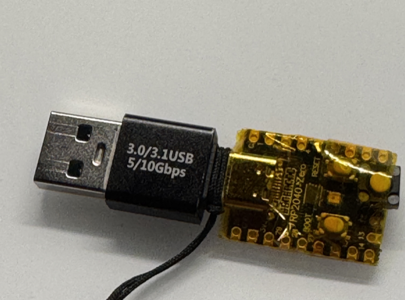

# Password Manager OneKey

A simple USB keyboard password manager using QMK firmware on a KB2040 microcontroller board.



## Overview

This project creates a physical password manager that acts as a USB keyboard, automatically typing a pre-programmed password when its button is pressed. It's based on QMK firmware and uses a KB2040 (RP2040-based) microcontroller board.

## Features

* **USB Keyboard Emulation:** Automatically types stored passwords when button is pressed
* **Hardware-based Security:** Password is stored in firmware, not in software
* **Customizable:** Easy to modify passwords and add multiple password slots
* **Plug-and-Play:** Works on any device that accepts USB keyboards

## Hardware Requirements

* **KB2040 Board:** RP2040-based microcontroller board
* **Push Button Switch:** 2.54mm pitch push switch (recommended for mouse clicks)
* **Wiring:** Connect button between GP9 and GP11 pins (configurable)

## How It Works

* **Functionality:** Emulates a USB keyboard to automatically type a stored password
* **Hardware:** Uses a push-button switch connected to specific pins on the KB2040 board
* **Firmware:** Based on QMK firmware (`qmk_firmware/keyboards/handwired/onekey/kb2040/`)

## Use Cases

* **Securely storing and quickly entering complex passwords**
* **Automating logins for frequently used accounts**
* **Simplifying password entry on devices with limited input methods**
* **Physical security key for password access**

## Quick Start

1. **Hardware Setup:**
   - Connect a push button between GP9 and GP11 pins on the KB2040 board
   - Connect the board to your computer via USB

2. **Firmware Setup:**
   - Follow the QMK setup instructions below
   - Customize the password in `keymap.c` if needed
   - Flash the firmware to your KB2040 board

3. **Usage:**
   - Connect the device to your computer's USB port
   - Press the button to automatically type the stored password

## QMK Setup and Building

### Prerequisites

1. Install QMK Toolbox and QMK CLI tools
2. Set up your build environment following the [QMK documentation](https://docs.qmk.fm/#/getting_started_build_tools)

### Building the Firmware

```bash
# Clone this repository
git clone <your-repo-url>
cd 205_PasswordManager_onekey

# Build the firmware
make handwired/onekey:default

# Flash to KB2040 (replace with your port)
make handwired/onekey:default:flash
```

### Customizing the Password

1. **Copy the example password file:**
   ```bash
   cd onekey/keymaps/default/
   cp passwords.h.example passwords.h
   ```

2. **Edit the password file:**
   Open `onekey/keymaps/default/passwords.h` and modify the passwords:
   ```c
   // Password for MACRO_A (main password)
   #define PASSWORD_A "your_actual_password_here"
   
   // Password for MACRO_B (secondary password)
   #define PASSWORD_B "your_secondary_password_here"
   ```

3. **Build and flash:**
   ```bash
   make handwired/onekey:default:flash
   ```

**Important Security Notes:**
- The `passwords.h` file is excluded from version control for security
- Never commit your actual passwords to the repository
- Use the `passwords.h.example` file as a template

## Security Considerations

⚠️ **Important Security Notes:**

* The password is stored in plain text in the firmware
* Anyone with access to the device can extract the password
* Use this only for non-critical passwords or in trusted environments
* Consider using a proper password manager for sensitive accounts

## Contributing

1. Fork the repository
2. Create a feature branch
3. Make your changes
4. Test thoroughly
5. Submit a pull request

## License

This project is licensed under the GPL-2.0-or-later license - see the [LICENSE](LICENSE) file for details.

## Acknowledgments

* Based on [QMK Firmware](https://github.com/qmk/qmk_firmware)
* Uses the handwired/onekey keyboard template
* Hardware design inspired by the KB2040 board

